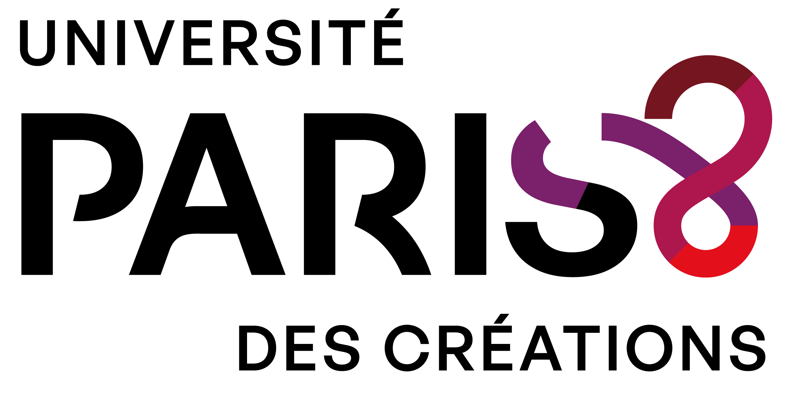
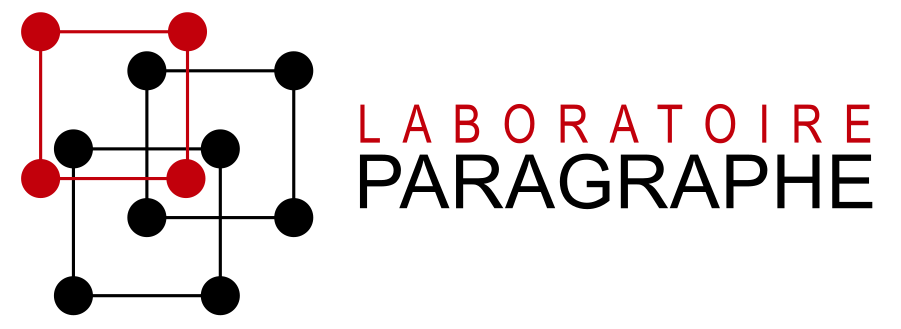
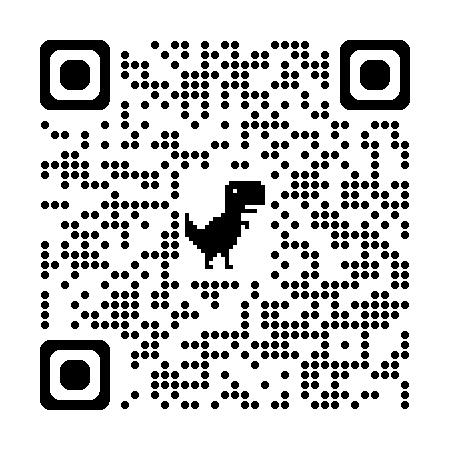
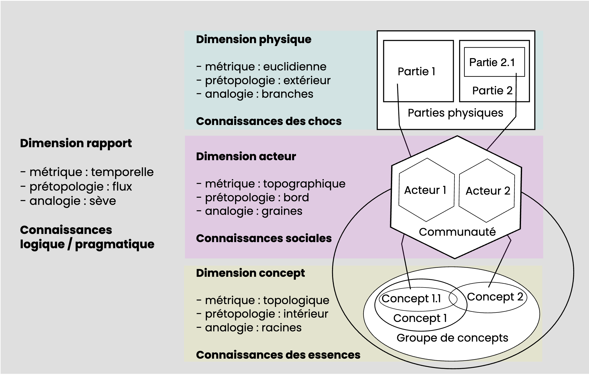
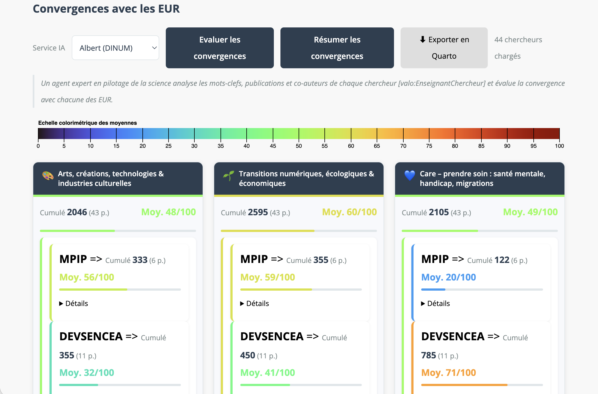
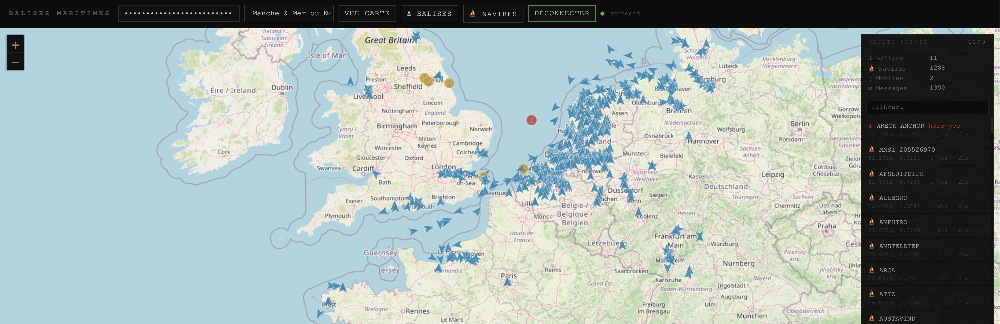

| {height=100} | {height=100} | {height=120} |
|-----------|-----------|-----------|


# DTDM Athenes 2026

Digital Transformation Design & Management : Launch of the international Mester's Programme

## Sustainable Digital Design & Ethical Technology

### What is Sustainable Digital Design ?

#### Guattari’s Ecosophy: The Three Ecologies and Epistemic Transversality


[Sources](https://notebooklm.google.com/notebook/e867d10b-e25c-403a-b6cc-2b23b244644c)

#### The symbiosis between humans, AI agents and Gaïa

The critical challenge of the symbiosis between humans, AI agents, and the environment lies in designing technological ecosystems that **augment human capabilities** and promote **ecological regeneration**, ensuring that artificial intelligence serves as a catalyst for sustainable coexistence rather than a **driver of exploitation**.


[Sources](https://notebooklm.google.com/notebook/980d718e-656e-4b37-93fd-0b9d047c9620)

#### Modeling informational existences




### What is Ethics ?


```         
The point of view of ethics is: what are you capable of, what can you do ?
```

### Why Ethical Technology is an ethical issue ?


#### Examples of what can be done ?

Some examples of AI use in academic work.

##### Generate proposals for interventions in a conference

The Gemini AI calculates the relationship between the conference profile and a researcher's profile; an algorithm calculates the Markdown pages and generates a website.

1.  [Conference digital borders](https://humanum-p8.fr/conferences/frontieres-numeriques_2026/docs/)

2.  [Use Scanr information](https://scanr.enseignementsup-recherche.gouv.fr/authors/idref182295591)

3.  [Program for Conference digital borders](https://humanum-p8.fr/conferences/frontieres-numeriques_2026/docs/programme.html)

##### Calculate the convergence between university research schools and laboratory axes

1.  [Use Scanr information](https://scanr.enseignementsup-recherche.gouv.fr/authors/idref182295591)

2.  [Albert IA](https://www.numerique.gouv.fr/offre-accompagnement/expertise-albert-ia-etat/)

3.  

4.  [Validation system](https://valorisation.humanum-p8.fr/s/cartoexpert/page/test-expertises)

##### Create creative applications without needing extensive computer programming knowledge.



[Wiki My Pedia](https://vascomo.github.io/wiki-my-pedia/wikidata-search.html)

[Master 1 projects](https://humanites-numeriques-universite-paris-8.github.io/Net1_25-26_dev/cours3.html)

### How to model the increase and decrease of power for a specific mode of existence ?

[Web applications to assess the evolution of power for an existence](https://acehn.jardindesconnaissances.fr/pulsationsExistentielles/index.html)


### To be continued.
There is much work to be done to enable everyone to assess the increase or decrease in their own fundamental capacities :

- discernment,

- reasoning,

- resonance, 

- action.

It is possible to gather all this personal information, but should we ? 

How ? 

The DTDM Master's program is the space where these questions can be addressed and future citizens can answer them... 

I hope...