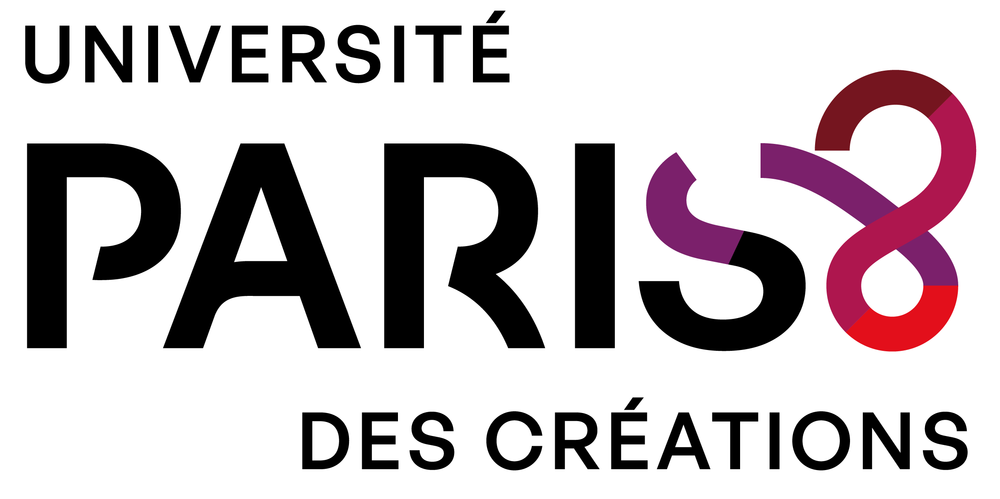
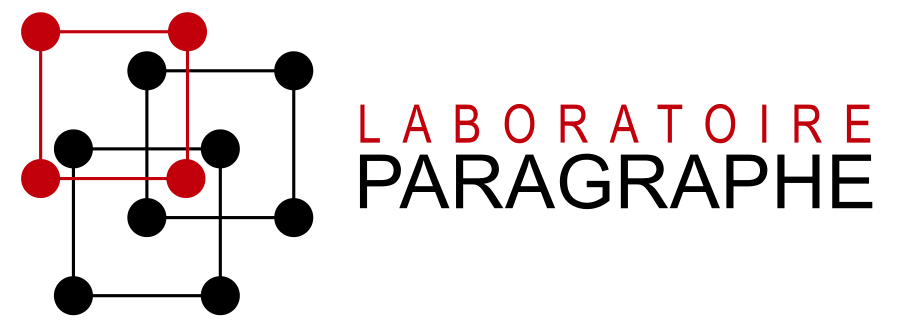
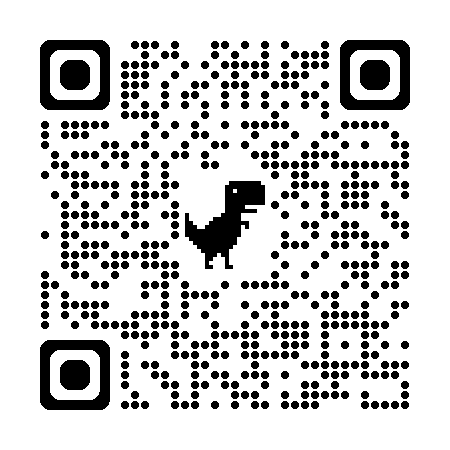

+----------------------+----------------------+----------------------+
|                      |                      |                      |
+======================+======================+======================+
+----------------------+----------------------+----------------------+

# Fête de la science 2026

## Saveurs savantes

<a href="https://www.univ-paris8.fr/Fete-de-la-Science-2026" target="_blank">Site de l'évènement</a>

| {height=100} | {height=100} | {height=120} |
|-----------|-----------|-----------|

# Usages des intelligences artificielles pour le développement des intelligences collectives

## Version dynamique

[Voir en plein écran](fete-science-2026/slide.html){target="_blank"}

```{=html}
<iframe width="800" height="600" src="ia-iv-humain-2026/slide.html" title="Support de présentation"></iframe>
```




## résumé 
Pour explorer comment les IA transforment nos façons de collaborer, de partager les connaissances et de construire ensemble de nouvelles intelligences collectives.  possibles et sauvegarder l'avenir de la biosphère.

