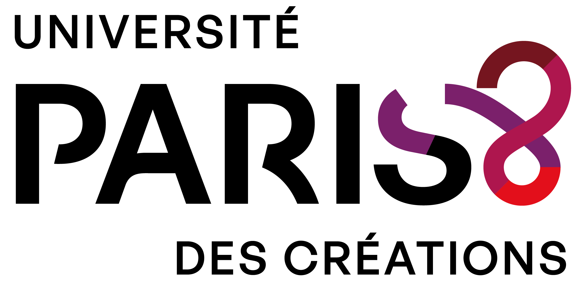
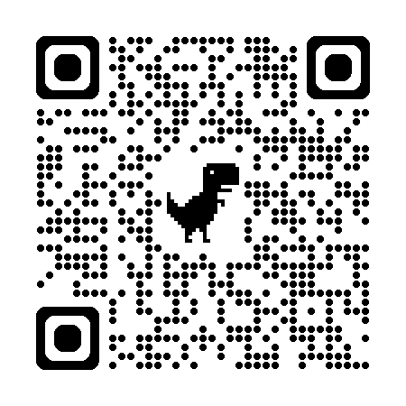

| {height=100} | {height=100} | {height=120} |
|-----------|-----------|-----------|

# Frontières Numériques 7

## Analogies & Technologies

Colloque international du 4-6 juin 2026, Djerba, Tunisie

<a href="https://humanum-p8.fr/conferences/frontieres-numeriques_2026/docs/" target="_blank">Site de la conférence</a>

# L'analogie au coeur des technologies

### Présentation

[Voir en plein écran](FrontNum_2026/slide.html)

```{=html}
<iframe width="800" height="600" src="FrontNum_2026/slide.html" title="Support de présentation"></iframe>
```
